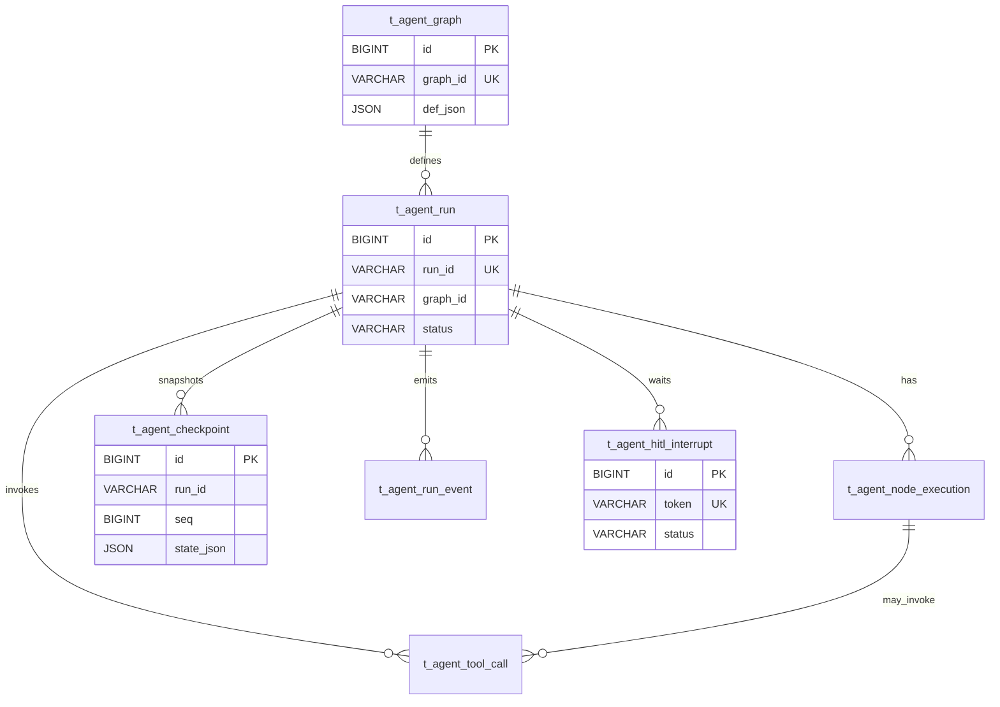

# agent-runtime 库表设计

> 主输入：`designs/v0/agent-runtime-control/page.logic.md`（由已批 spec 推导的控制面逻辑）  
> EntityGraph：空（WARN）→ 全部 **create**  
> 规范：`.apt/code-standards.md` 数据库节  
> 豁免：无多租户产品 → 不强制 `tenant_id`；creator/updater 对系统 run 允许为 `system`

## 变更摘要
- 新建表：`t_agent_graph`, `t_agent_run`, `t_agent_node_execution`, `t_agent_checkpoint`, `t_agent_tool_call`, `t_agent_run_event`, `t_agent_hitl_interrupt`
- 变更表：无
- 实体处置：全部 create（EntityGraph 空）

## 表清单

### 表 `t_agent_graph`
- 表名：`t_agent_graph`
- 处置：create
- 主键：`id`
- 索引：`uk_t_agent_graph_graph_id` / `idx_t_agent_graph_name`

| 字段名 | 类型 | 可空 | 说明 |
|--------|------|------|------|
| id | BIGINT | NO | 主键 |
| graph_id | VARCHAR(64) | NO | 对外 graph 标识 |
| name | VARCHAR(128) | YES | 可读名称 |
| version | INT | NO | 图版本，默认 1 |
| def_json | JSON | NO | 编译后的图定义快照 |
| status | TINYINT | NO | 1=active 0=disabled |
| created_at | DATETIME | NO | 创建时间 |
| updated_at | DATETIME | NO | 更新时间 |
| creator | VARCHAR(64) | NO | 创建人 |
| updater | VARCHAR(64) | NO | 更新人 |
| deleted | TINYINT(1) | NO | 逻辑删除 0/1 |

### 表 `t_agent_run`
- 表名：`t_agent_run`
- 处置：create
- 主键：`id`
- 索引：`uk_t_agent_run_run_id` / `idx_t_agent_run_graph_id` / `idx_t_agent_run_thread_id` / `idx_t_agent_run_status`

| 字段名 | 类型 | 可空 | 说明 |
|--------|------|------|------|
| id | BIGINT | NO | 主键 |
| run_id | VARCHAR(64) | NO | 对外 run 标识 |
| graph_id | VARCHAR(64) | NO | 关联 graph_id |
| thread_id | VARCHAR(64) | YES | 会话/线程聚合键 |
| status | VARCHAR(32) | NO | created/running/waiting_hitl/completed/failed/cancelled |
| input_json | JSON | YES | 启动输入 |
| output_json | JSON | YES | 终态输出 |
| error_json | JSON | YES | 失败原因 |
| current_node_id | VARCHAR(64) | YES | 当前/最近节点 |
| parent_run_id | VARCHAR(64) | YES | 子图父 run |
| started_at | DATETIME | YES | 开始时间 |
| finished_at | DATETIME | YES | 结束时间 |
| created_at | DATETIME | NO | 创建时间 |
| updated_at | DATETIME | NO | 更新时间 |
| creator | VARCHAR(64) | NO | 创建人 |
| updater | VARCHAR(64) | NO | 更新人 |
| deleted | TINYINT(1) | NO | 逻辑删除 0/1 |

### 表 `t_agent_node_execution`
- 表名：`t_agent_node_execution`
- 处置：create
- 主键：`id`
- 索引：`idx_t_agent_node_execution_run_id` / `idx_t_agent_node_execution_node_id` / `uk_t_agent_node_execution_run_node_attempt`

| 字段名 | 类型 | 可空 | 说明 |
|--------|------|------|------|
| id | BIGINT | NO | 主键 |
| run_id | VARCHAR(64) | NO | 所属 run |
| node_id | VARCHAR(64) | NO | 图内节点 id |
| node_type | VARCHAR(32) | NO | llm/tool/fn/branch/hitl/subgraph |
| attempt | INT | NO | 第几次尝试，从 1 |
| status | VARCHAR(32) | NO | pending/running/succeeded/failed/skipped/waiting_hitl |
| input_json | JSON | YES | 节点输入快照 |
| output_json | JSON | YES | 节点输出 |
| error_json | JSON | YES | 错误 |
| started_at | DATETIME | YES | 开始 |
| finished_at | DATETIME | YES | 结束 |
| created_at | DATETIME | NO | 创建时间 |
| updated_at | DATETIME | NO | 更新时间 |
| creator | VARCHAR(64) | NO | 创建人 |
| updater | VARCHAR(64) | NO | 更新人 |
| deleted | TINYINT(1) | NO | 逻辑删除 0/1 |

### 表 `t_agent_checkpoint`
- 表名：`t_agent_checkpoint`
- 处置：create
- 主键：`id`
- 索引：`idx_t_agent_checkpoint_run_id` / `uk_t_agent_checkpoint_run_seq`

| 字段名 | 类型 | 可空 | 说明 |
|--------|------|------|------|
| id | BIGINT | NO | 主键 |
| run_id | VARCHAR(64) | NO | 所属 run |
| seq | BIGINT | NO | run 内递增序号 |
| node_id | VARCHAR(64) | YES | 触发 checkpoint 的节点 |
| state_json | JSON | NO | 全量/增量状态（首版全量） |
| metadata_json | JSON | YES | 扩展元数据 |
| created_at | DATETIME | NO | 创建时间 |
| updated_at | DATETIME | NO | 更新时间 |
| creator | VARCHAR(64) | NO | 创建人 |
| updater | VARCHAR(64) | NO | 更新人 |
| deleted | TINYINT(1) | NO | 逻辑删除 0/1 |

### 表 `t_agent_tool_call`
- 表名：`t_agent_tool_call`
- 处置：create
- 主键：`id`
- 索引：`idx_t_agent_tool_call_run_id` / `uk_t_agent_tool_call_idempotency` / `idx_t_agent_tool_call_tool_name`

| 字段名 | 类型 | 可空 | 说明 |
|--------|------|------|------|
| id | BIGINT | NO | 主键 |
| run_id | VARCHAR(64) | NO | 所属 run |
| node_execution_id | BIGINT | YES | 关联节点执行 id |
| tool_name | VARCHAR(128) | NO | 工具名 |
| idempotency_key | VARCHAR(128) | NO | 幂等键（防崩溃重放副作用） |
| request_json | JSON | YES | 入参 |
| response_json | JSON | YES | 出参 |
| status | VARCHAR(32) | NO | pending/succeeded/failed/timeout |
| error_json | JSON | YES | 错误 |
| duration_ms | INT | YES | 耗时 |
| created_at | DATETIME | NO | 创建时间 |
| updated_at | DATETIME | NO | 更新时间 |
| creator | VARCHAR(64) | NO | 创建人 |
| updater | VARCHAR(64) | NO | 更新人 |
| deleted | TINYINT(1) | NO | 逻辑删除 0/1 |

### 表 `t_agent_run_event`
- 表名：`t_agent_run_event`
- 处置：create
- 主键：`id`
- 索引：`idx_t_agent_run_event_run_id` / `idx_t_agent_run_event_type` / `uk_t_agent_run_event_run_seq`

| 字段名 | 类型 | 可空 | 说明 |
|--------|------|------|------|
| id | BIGINT | NO | 主键 |
| run_id | VARCHAR(64) | NO | 所属 run |
| seq | BIGINT | NO | run 内事件序 |
| event_type | VARCHAR(64) | NO | node_start/node_end/tool_call/checkpoint/hitl/... |
| payload_json | JSON | NO | 事件载荷 |
| created_at | DATETIME | NO | 创建时间 |
| updated_at | DATETIME | NO | 更新时间 |
| creator | VARCHAR(64) | NO | 创建人 |
| updater | VARCHAR(64) | NO | 更新人 |
| deleted | TINYINT(1) | NO | 逻辑删除 0/1 |

### 表 `t_agent_hitl_interrupt`
- 表名：`t_agent_hitl_interrupt`
- 处置：create
- 主键：`id`
- 索引：`uk_t_agent_hitl_interrupt_token` / `idx_t_agent_hitl_interrupt_run_id` / `idx_t_agent_hitl_interrupt_status`

| 字段名 | 类型 | 可空 | 说明 |
|--------|------|------|------|
| id | BIGINT | NO | 主键 |
| run_id | VARCHAR(64) | NO | 所属 run |
| node_id | VARCHAR(64) | NO | HITL 节点 |
| token | VARCHAR(128) | NO | 一次性恢复令牌 |
| status | VARCHAR(32) | NO | open/resumed/expired |
| payload_json | JSON | YES | 展示给操作者的中断载荷 |
| decision_json | JSON | YES | 人工决策 |
| expires_at | DATETIME | YES | 超时 |
| resumed_at | DATETIME | YES | 恢复时间 |
| created_at | DATETIME | NO | 创建时间 |
| updated_at | DATETIME | NO | 更新时间 |
| creator | VARCHAR(64) | NO | 创建人 |
| updater | VARCHAR(64) | NO | 更新人 |
| deleted | TINYINT(1) | NO | 逻辑删除 0/1 |

## 关系
| from | to | kind |
|------|----|------|
| t_agent_graph | t_agent_run | one-to-many |
| t_agent_run | t_agent_node_execution | one-to-many |
| t_agent_run | t_agent_checkpoint | one-to-many |
| t_agent_run | t_agent_tool_call | one-to-many |
| t_agent_run | t_agent_run_event | one-to-many |
| t_agent_run | t_agent_hitl_interrupt | one-to-many |
| t_agent_node_execution | t_agent_tool_call | one-to-many |

## E-R

## 假设与豁免
- EntityGraph 为空，全部 create。
- 无 page UI；逻辑页由 approved spec 控制面契约生成。
- 无多租户 → 省略 tenant_id。
- SQLite 首版将 JSON 映射为 TEXT；Postgres 可用原生 JSON。
