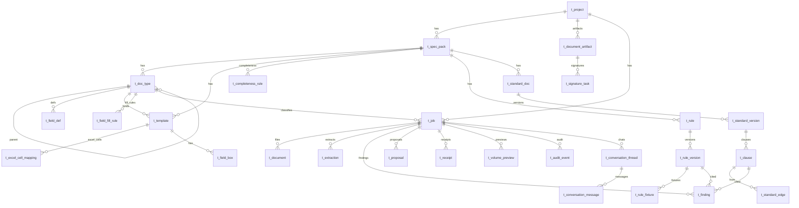

# core-engine 库表设计

> 主输入：`designs/v0/**/page.logic.md`（9 页已 PM 批准）+ `docs/prd/工程资料核心引擎.md`  
> EntityGraph：`query_contract(EntityGraph)` 未命中；`search_arch` 仅有 agent-runtime 七表 DDL → **业务实体全部 create**；运行时七表 **reuse**  
> 规范：`.apt/code-standards.md` 数据库节  
> 存储：业务账本 **PostgreSQL**；认知运行时 **SQLite**（已有 `docs/schema/agent-runtime-schema.md`）；向量 **Qdrant**；图 **Neo4j**（见文末，非本文件 DO 范围）  
> 豁免：无多租户 → 省略 `tenant_id`。Job/Proposal 状态用 VARCHAR(32) 对齐产品状态机字面量（与 agent-runtime `t_agent_run.status` 同口径），不用 TINYINT 码表。

## 变更摘要

- 新建表：`t_project`, `t_spec_pack`, `t_doc_type`, `t_field_def`, `t_template`, `t_excel_cell_mapping`, `t_field_fill_rule`, `t_document_artifact`, `t_signature_task`, `t_completeness_rule`, `t_field_box`, `t_rule`, `t_rule_version`, `t_rule_fixture`, `t_standard_doc`, `t_standard_version`, `t_clause`, `t_standard_edge`, `t_job`, `t_document`, `t_extraction`, `t_finding`, `t_proposal`, `t_receipt`, `t_volume_preview`, `t_audit_event`, `t_conversation_thread`, `t_conversation_message`
- 变更表：`t_template` 增 `doc_type_id`、`layout_kind`、`excel_template_uri`、`excel_sheet_name`；`t_job` 增 `doc_type_id`
- 复用表：`t_agent_graph`, `t_agent_run`, `t_agent_node_execution`, `t_agent_checkpoint`, `t_agent_tool_call`, `t_agent_run_event`, `t_agent_hitl_interrupt`（见 `docs/schema/agent-runtime-schema.md`）
- 实体处置：`Project/SpecPack/DocType/FieldDef/Template/FieldBox/Rule/RuleVersion/StandardDoc/Clause/Job/Document/Extraction/Finding/Proposal/Receipt/VolumePreview/AuditEvent/ConversationThread=create`；`AgentRun/HitlInterrupt=reuse`

SLICE-1 先 apply：`t_project`, `t_job`, `t_document`, `t_extraction`, `t_rule`, `t_rule_version`, `t_finding`, `t_audit_event`, `t_conversation_thread`, `t_conversation_message`。其余随 SLICE-2～6 同一份设计落库，不另开 schema 文件。

## 表清单

### 表 `t_project`
- 表名：`t_project`
- 处置：create
- 主键：`id`
- 索引：`uk_t_project_project_id`

| 字段名 | 类型 | 可空 | 说明 |
|--------|------|------|------|
| id | BIGINT | NO | 主键 |
| project_id | VARCHAR(64) | NO | 对外项目标识 |
| name | VARCHAR(128) | NO | 项目名 |
| created_at | DATETIME | NO | 创建时间 |
| updated_at | DATETIME | NO | 更新时间 |
| creator | VARCHAR(64) | NO | 创建人 |
| updater | VARCHAR(64) | NO | 更新人 |
| deleted | TINYINT(1) | NO | 逻辑删除 0/1 |

### 表 `t_spec_pack`
- 表名：`t_spec_pack`
- 处置：create
- 主键：`id`
- 索引：`uk_t_spec_pack_pack_id` / `idx_t_spec_pack_project_id`

| 字段名 | 类型 | 可空 | 说明 |
|--------|------|------|------|
| id | BIGINT | NO | 主键 |
| pack_id | VARCHAR(64) | NO | 对外规范包标识 |
| project_id | VARCHAR(64) | NO | 所属项目 |
| name | VARCHAR(128) | NO | 空包名称，禁止预置公路字样 |
| version | VARCHAR(32) | NO | 规范包版本 |
| group_keys_json | JSON | YES | 组卷 groupKeys[] |
| order_key | VARCHAR(64) | YES | 组内排序字段 |
| effective_standard_version_id | VARCHAR(64) | YES | 绑定生效标准版本 |
| created_at | DATETIME | NO | 创建时间 |
| updated_at | DATETIME | NO | 更新时间 |
| creator | VARCHAR(64) | NO | 创建人 |
| updater | VARCHAR(64) | NO | 更新人 |
| deleted | TINYINT(1) | NO | 逻辑删除 0/1 |

### 表 `t_doc_type`
- 表名：`t_doc_type`
- 处置：create
- 主键：`id`
- 索引：`uk_t_doc_type_doc_type_id` / `idx_t_doc_type_pack_id` / `idx_t_doc_type_parent_doc_type_id`

| 字段名 | 类型 | 可空 | 说明 |
|--------|------|------|------|
| id | BIGINT | NO | 主键 |
| doc_type_id | VARCHAR(64) | NO | 对外文档类型标识 |
| pack_id | VARCHAR(64) | NO | 所属规范包 |
| parent_doc_type_id | VARCHAR(64) | YES | 父类型（可空，支持继承链） |
| name | VARCHAR(128) | NO | 类型名称 |
| created_at | DATETIME | NO | 创建时间 |
| updated_at | DATETIME | NO | 更新时间 |
| creator | VARCHAR(64) | NO | 创建人 |
| updater | VARCHAR(64) | NO | 更新人 |
| deleted | TINYINT(1) | NO | 逻辑删除 0/1 |

### 表 `t_field_def`
- 表名：`t_field_def`
- 处置：create
- 主键：`id`
- 索引：`idx_t_field_def_doc_type_id` / `uk_t_field_def_doc_type_field`

| 字段名 | 类型 | 可空 | 说明 |
|--------|------|------|------|
| id | BIGINT | NO | 主键 |
| doc_type_id | VARCHAR(64) | NO | 所属文档类型 |
| field_key | VARCHAR(64) | NO | 字段名（无坐标） |
| value_type | VARCHAR(32) | NO | string/date/number |
| required | TINYINT(1) | NO | 是否必填 0/1 |
| created_at | DATETIME | NO | 创建时间 |
| updated_at | DATETIME | NO | 更新时间 |
| creator | VARCHAR(64) | NO | 创建人 |
| updater | VARCHAR(64) | NO | 更新人 |
| deleted | TINYINT(1) | NO | 逻辑删除 0/1 |

### 表 `t_template`
- 表名：`t_template`
- 处置：create
- 主键：`id`
- 索引：`uk_t_template_template_id` / `idx_t_template_pack_id` / `idx_t_template_doc_type_id`

| 字段名 | 类型 | 可空 | 说明 |
|--------|------|------|------|
| id | BIGINT | NO | 主键 |
| template_id | VARCHAR(64) | NO | 对外模板标识 |
| pack_id | VARCHAR(64) | NO | 所属规范包 |
| doc_type_id | VARCHAR(64) | NO | 绑定文档类型 |
| name | VARCHAR(128) | NO | 模板名 |
| page_image_uri | VARCHAR(512) | YES | 页图存储 URI |
| layout_kind | VARCHAR(16) | NO | 布局模式：`raster` / `excel`，默认 `raster` |
| excel_template_uri | VARCHAR(512) | YES | Excel 模板 Blob URI |
| excel_sheet_name | VARCHAR(128) | YES | 默认业务 sheet 名 |
| created_at | DATETIME | NO | 创建时间 |
| updated_at | DATETIME | NO | 更新时间 |
| creator | VARCHAR(64) | NO | 创建人 |
| updater | VARCHAR(64) | NO | 更新人 |
| deleted | TINYINT(1) | NO | 逻辑删除 0/1 |

### 表 `t_excel_cell_mapping`
- 表名：`t_excel_cell_mapping`
- 处置：create
- 主键：`id`
- 索引：`uk_t_excel_cell_mapping_mapping_id` / `idx_t_excel_cell_mapping_template_id` / `uk_t_excel_cell_mapping_template_sheet_cell`

| 字段名 | 类型 | 可空 | 说明 |
|--------|------|------|------|
| id | BIGINT | NO | 主键 |
| mapping_id | VARCHAR(64) | NO | 对外映射标识 |
| template_id | VARCHAR(64) | NO | 所属模板 |
| sheet_name | VARCHAR(128) | NO | Sheet 名 |
| cell | VARCHAR(16) | NO | 单元格地址，如 `B4` |
| field_key | VARCHAR(64) | NO | 绑定字段 |
| value_type | VARCHAR(32) | NO | string/text/date/signature |
| signature_role | VARCHAR(64) | YES | 签字角色 |
| created_at | DATETIME | NO | 创建时间 |
| updated_at | DATETIME | NO | 更新时间 |
| creator | VARCHAR(64) | NO | 创建人 |
| updater | VARCHAR(64) | NO | 更新人 |
| deleted | TINYINT(1) | NO | 逻辑删除 0/1 |

### 表 `t_field_fill_rule`
- 表名：`t_field_fill_rule`
- 处置：create
- 主键：`id`
- 索引：`idx_t_field_fill_rule_doc_type_id` / `uk_t_field_fill_rule_doc_type_field`

| 字段名 | 类型 | 可空 | 说明 |
|--------|------|------|------|
| id | BIGINT | NO | 主键 |
| doc_type_id | VARCHAR(64) | NO | 所属文档类型 |
| field_key | VARCHAR(64) | NO | 字段名 |
| required | TINYINT(1) | NO | 是否必填 0/1 |
| pattern | VARCHAR(256) | YES | 正则校验 |
| min_num | DECIMAL | YES | 数值下限 |
| max_num | DECIMAL | YES | 数值上限 |
| default_generator | VARCHAR(32) | YES | literal/project_field/compliance_sample |
| default_literal | TEXT | YES | 字面量默认值 |
| created_at | DATETIME | NO | 创建时间 |
| updated_at | DATETIME | NO | 更新时间 |
| creator | VARCHAR(64) | NO | 创建人 |
| updater | VARCHAR(64) | NO | 更新人 |
| deleted | TINYINT(1) | NO | 逻辑删除 0/1 |

### 表 `t_document_artifact`
- 表名：`t_document_artifact`
- 处置：create
- 主键：`id`
- 索引：`uk_t_document_artifact_artifact_id` / `idx_t_document_artifact_project_id` / `idx_t_document_artifact_doc_type_id` / `idx_t_document_artifact_trace_id`

| 字段名 | 类型 | 可空 | 说明 |
|--------|------|------|------|
| id | BIGINT | NO | 主键 |
| artifact_id | VARCHAR(64) | NO | 对外产物标识 |
| project_id | VARCHAR(64) | NO | 所属项目 |
| doc_type_id | VARCHAR(64) | NO | 文档类型 |
| template_id | VARCHAR(64) | NO | 所用模板 |
| file_uri | VARCHAR(512) | NO | 生成 xlsx URI |
| adapter_document_id | VARCHAR(64) | YES | 中台文档 ID |
| status | VARCHAR(32) | NO | generated/uploaded/failed |
| trace_id | VARCHAR(64) | NO | 审计 trace |
| receipt_id | VARCHAR(64) | YES | 上传回执 |
| metadata_json | TEXT | YES | fieldValues 快照 |
| created_at | DATETIME | NO | 创建时间 |
| updated_at | DATETIME | NO | 更新时间 |
| creator | VARCHAR(64) | NO | 创建人 |
| updater | VARCHAR(64) | NO | 更新人 |
| deleted | TINYINT(1) | NO | 逻辑删除 0/1 |

### 表 `t_signature_task`
- 表名：`t_signature_task`
- 处置：create
- 主键：`id`
- 索引：`uk_t_signature_task_task_id` / `idx_t_signature_task_artifact_id` / `idx_t_signature_task_trace_id`

| 字段名 | 类型 | 可空 | 说明 |
|--------|------|------|------|
| id | BIGINT | NO | 主键 |
| task_id | VARCHAR(64) | NO | 对外待签任务标识 |
| artifact_id | VARCHAR(64) | NO | 所属产物 |
| role | VARCHAR(64) | NO | 签字角色 |
| assignee_label | VARCHAR(128) | YES | 展示用指派人 |
| status | VARCHAR(32) | NO | pending/signed/rejected |
| signer_name | VARCHAR(128) | YES | 确认时填写 |
| trace_id | VARCHAR(64) | NO | 审计 trace |
| receipt_id | VARCHAR(64) | YES | 签字回执 |
| created_at | DATETIME | NO | 创建时间 |
| updated_at | DATETIME | NO | 更新时间 |
| creator | VARCHAR(64) | NO | 创建人 |
| updater | VARCHAR(64) | NO | 更新人 |
| deleted | TINYINT(1) | NO | 逻辑删除 0/1 |

### 表 `t_completeness_rule`
- 表名：`t_completeness_rule`
- 处置：create
- 主键：`id`
- 索引：`uk_t_completeness_rule_rule_id` / `idx_t_completeness_rule_pack_id`

| 字段名 | 类型 | 可空 | 说明 |
|--------|------|------|------|
| id | BIGINT | NO | 主键 |
| rule_id | VARCHAR(64) | NO | 对外规则标识 |
| pack_id | VARCHAR(64) | NO | 所属规范包 |
| doc_type_id | VARCHAR(64) | NO | 应备文档类型 |
| label | VARCHAR(128) | NO | 展示名 |
| required | TINYINT(1) | NO | 是否必備 0/1 |
| created_at | DATETIME | NO | 创建时间 |
| updated_at | DATETIME | NO | 更新时间 |
| creator | VARCHAR(64) | NO | 创建人 |
| updater | VARCHAR(64) | NO | 更新人 |
| deleted | TINYINT(1) | NO | 逻辑删除 0/1 |

### 表 `t_field_box`
- 表名：`t_field_box`
- 处置：create
- 主键：`id`
- 索引：`idx_t_field_box_template_id` / `uk_t_field_box_template_field`

| 字段名 | 类型 | 可空 | 说明 |
|--------|------|------|------|
| id | BIGINT | NO | 主键 |
| template_id | VARCHAR(64) | NO | 所属模板 |
| field_key | VARCHAR(64) | NO | 字段名，如 编号/日期A |
| value_type | VARCHAR(32) | NO | string/date/number |
| page | INT | NO | 页码 |
| x | DECIMAL(10,4) | NO | 框选 x |
| y | DECIMAL(10,4) | NO | 框选 y |
| w | DECIMAL(10,4) | NO | 宽 |
| h | DECIMAL(10,4) | NO | 高 |
| created_at | DATETIME | NO | 创建时间 |
| updated_at | DATETIME | NO | 更新时间 |
| creator | VARCHAR(64) | NO | 创建人 |
| updater | VARCHAR(64) | NO | 更新人 |
| deleted | TINYINT(1) | NO | 逻辑删除 0/1 |

### 表 `t_rule`
- 表名：`t_rule`
- 处置：create
- 主键：`id`
- 索引：`uk_t_rule_rule_id` / `idx_t_rule_pack_id`

| 字段名 | 类型 | 可空 | 说明 |
|--------|------|------|------|
| id | BIGINT | NO | 主键 |
| rule_id | VARCHAR(64) | NO | 如 R1 |
| pack_id | VARCHAR(64) | NO | 所属规范包 |
| title | VARCHAR(128) | YES | 显示名 |
| created_at | DATETIME | NO | 创建时间 |
| updated_at | DATETIME | NO | 更新时间 |
| creator | VARCHAR(64) | NO | 创建人 |
| updater | VARCHAR(64) | NO | 更新人 |
| deleted | TINYINT(1) | NO | 逻辑删除 0/1 |

### 表 `t_rule_version`
- 表名：`t_rule_version`
- 处置：create
- 主键：`id`
- 索引：`uk_t_rule_version_version_id` / `idx_t_rule_version_rule_id`

| 字段名 | 类型 | 可空 | 说明 |
|--------|------|------|------|
| id | BIGINT | NO | 主键 |
| version_id | VARCHAR(64) | NO | 规则版本标识 |
| rule_id | VARCHAR(64) | NO | 所属规则 |
| dsl_json | JSON | NO | DSL 子集 |
| status | VARCHAR(32) | NO | draft/published |
| blocking | TINYINT(1) | NO | 默认 1：命中则不得自动通过 |
| created_at | DATETIME | NO | 创建时间 |
| updated_at | DATETIME | NO | 更新时间 |
| creator | VARCHAR(64) | NO | 创建人 |
| updater | VARCHAR(64) | NO | 更新人 |
| deleted | TINYINT(1) | NO | 逻辑删除 0/1 |

### 表 `t_rule_fixture`
- 表名：`t_rule_fixture`
- 处置：create
- 主键：`id`
- 索引：`idx_t_rule_fixture_version_id`

| 字段名 | 类型 | 可空 | 说明 |
|--------|------|------|------|
| id | BIGINT | NO | 主键 |
| version_id | VARCHAR(64) | NO | 所属规则版本 |
| kind | VARCHAR(32) | NO | pass/fail（正例/反例） |
| payload_json | JSON | NO | 夹具抽取 JSON |
| last_result | VARCHAR(32) | YES | pass/fail |
| created_at | DATETIME | NO | 创建时间 |
| updated_at | DATETIME | NO | 更新时间 |
| creator | VARCHAR(64) | NO | 创建人 |
| updater | VARCHAR(64) | NO | 更新人 |
| deleted | TINYINT(1) | NO | 逻辑删除 0/1 |

### 表 `t_standard_doc`
- 表名：`t_standard_doc`
- 处置：create
- 主键：`id`
- 索引：`uk_t_standard_doc_doc_id` / `idx_t_standard_doc_pack_id`

| 字段名 | 类型 | 可空 | 说明 |
|--------|------|------|------|
| id | BIGINT | NO | 主键 |
| doc_id | VARCHAR(64) | NO | 对外文档标识 |
| pack_id | VARCHAR(64) | NO | 所属规范包 |
| title | VARCHAR(256) | NO | 标准题名 |
| file_uri | VARCHAR(512) | NO | 原文存储 |
| created_at | DATETIME | NO | 创建时间 |
| updated_at | DATETIME | NO | 更新时间 |
| creator | VARCHAR(64) | NO | 创建人 |
| updater | VARCHAR(64) | NO | 更新人 |
| deleted | TINYINT(1) | NO | 逻辑删除 0/1 |

### 表 `t_standard_version`
- 表名：`t_standard_version`
- 处置：create
- 主键：`id`
- 索引：`uk_t_standard_version_version_id` / `idx_t_standard_version_doc_id`

| 字段名 | 类型 | 可空 | 说明 |
|--------|------|------|------|
| id | BIGINT | NO | 主键 |
| version_id | VARCHAR(64) | NO | 如 v2024 |
| doc_id | VARCHAR(64) | NO | 所属标准文档 |
| status | VARCHAR(32) | NO | effective/superseded/revoked |
| created_at | DATETIME | NO | 创建时间 |
| updated_at | DATETIME | NO | 更新时间 |
| creator | VARCHAR(64) | NO | 创建人 |
| updater | VARCHAR(64) | NO | 更新人 |
| deleted | TINYINT(1) | NO | 逻辑删除 0/1 |

### 表 `t_clause`
- 表名：`t_clause`
- 处置：create
- 主键：`id`
- 索引：`uk_t_clause_clause_id` / `idx_t_clause_version_id`

| 字段名 | 类型 | 可空 | 说明 |
|--------|------|------|------|
| id | BIGINT | NO | 主键 |
| clause_id | VARCHAR(64) | NO | 条款号，Finding 只许挂此值 |
| version_id | VARCHAR(64) | NO | 所属标准版本 |
| parent_clause_id | VARCHAR(64) | YES | 父条 |
| heading | VARCHAR(256) | YES | 含父条标题 |
| body | TEXT | NO | 条款正文 |
| span_json | JSON | YES | 原文 span |
| qdrant_point_id | VARCHAR(64) | YES | 向量主键，等于 clause_id |
| created_at | DATETIME | NO | 创建时间 |
| updated_at | DATETIME | NO | 更新时间 |
| creator | VARCHAR(64) | NO | 创建人 |
| updater | VARCHAR(64) | NO | 更新人 |
| deleted | TINYINT(1) | NO | 逻辑删除 0/1 |

### 表 `t_standard_edge`
- 表名：`t_standard_edge`
- 处置：create
- 主键：`id`
- 索引：`idx_t_standard_edge_from` / `idx_t_standard_edge_to`

| 字段名 | 类型 | 可空 | 说明 |
|--------|------|------|------|
| id | BIGINT | NO | 主键 |
| from_clause_id | VARCHAR(64) | NO | 边起点 |
| to_clause_id | VARCHAR(64) | NO | 边终点 |
| kind | VARCHAR(32) | NO | CITES/SUPERSEDES/APPLIES_TO/REQUIRES |
| created_at | DATETIME | NO | 创建时间 |
| updated_at | DATETIME | NO | 更新时间 |
| creator | VARCHAR(64) | NO | 创建人 |
| updater | VARCHAR(64) | NO | 更新人 |
| deleted | TINYINT(1) | NO | 逻辑删除 0/1 |

### 表 `t_job`
- 表名：`t_job`
- 处置：create
- 主键：`id`
- 索引：`uk_t_job_job_id` / `uk_t_job_trace_id` / `idx_t_job_project_id` / `idx_t_job_status` / `idx_t_job_doc_type_id`

| 字段名 | 类型 | 可空 | 说明 |
|--------|------|------|------|
| id | BIGINT | NO | 主键 |
| job_id | VARCHAR(64) | NO | 对外任务标识 |
| project_id | VARCHAR(64) | NO | 所属项目 |
| pack_id | VARCHAR(64) | YES | 所用规范包 |
| trace_id | VARCHAR(64) | NO | 全链路对账键 |
| status | VARCHAR(32) | NO | uploaded/inspecting/extracting/checking/pending/previewed/failed |
| template_id | VARCHAR(64) | YES | 抽取所用模板 |
| doc_type_id | VARCHAR(64) | YES | 上传绑定的文档类型 |
| agent_run_id | VARCHAR(64) | YES | 关联 t_agent_run.run_id |
| created_at | DATETIME | NO | 创建时间 |
| updated_at | DATETIME | NO | 更新时间 |
| creator | VARCHAR(64) | NO | 创建人 |
| updater | VARCHAR(64) | NO | 更新人 |
| deleted | TINYINT(1) | NO | 逻辑删除 0/1 |

### 表 `t_document`
- 表名：`t_document`
- 处置：create
- 主键：`id`
- 索引：`uk_t_document_doc_id` / `idx_t_document_job_id`

| 字段名 | 类型 | 可空 | 说明 |
|--------|------|------|------|
| id | BIGINT | NO | 主键 |
| doc_id | VARCHAR(64) | NO | 对外文件标识 |
| job_id | VARCHAR(64) | NO | 所属 Job |
| file_name | VARCHAR(256) | NO | 原文件名 |
| file_uri | VARCHAR(512) | NO | 本地或 OSS URI |
| mime | VARCHAR(64) | YES | MIME |
| created_at | DATETIME | NO | 创建时间 |
| updated_at | DATETIME | NO | 更新时间 |
| creator | VARCHAR(64) | NO | 创建人 |
| updater | VARCHAR(64) | NO | 更新人 |
| deleted | TINYINT(1) | NO | 逻辑删除 0/1 |

### 表 `t_extraction`
- 表名：`t_extraction`
- 处置：create
- 主键：`id`
- 索引：`uk_t_extraction_extraction_id` / `idx_t_extraction_job_id`

| 字段名 | 类型 | 可空 | 说明 |
|--------|------|------|------|
| id | BIGINT | NO | 主键 |
| extraction_id | VARCHAR(64) | NO | 对外抽取标识 |
| job_id | VARCHAR(64) | NO | 所属 Job |
| ocr_text | TEXT | YES | 全文/文本层 |
| fields_json | JSON | NO | 按 FieldBox 抽取；框失败为 null |
| created_at | DATETIME | NO | 创建时间 |
| updated_at | DATETIME | NO | 更新时间 |
| creator | VARCHAR(64) | NO | 创建人 |
| updater | VARCHAR(64) | NO | 更新人 |
| deleted | TINYINT(1) | NO | 逻辑删除 0/1 |

### 表 `t_finding`
- 表名：`t_finding`
- 处置：create
- 主键：`id`
- 索引：`uk_t_finding_finding_id` / `idx_t_finding_job_id` / `idx_t_finding_clause_id`

| 字段名 | 类型 | 可空 | 说明 |
|--------|------|------|------|
| id | BIGINT | NO | 主键 |
| finding_id | VARCHAR(64) | NO | 对外命中标识 |
| job_id | VARCHAR(64) | NO | 所属 Job |
| rule_version_id | VARCHAR(64) | NO | 回放用规则版本 |
| result | VARCHAR(32) | NO | pass/fail |
| blocking | TINYINT(1) | NO | 1 则不得自动通过 |
| detail | VARCHAR(512) | YES | 失败说明 |
| clause_id | VARCHAR(64) | YES | 标准符合度必填；禁止 LLM 手写 |
| standard_version_id | VARCHAR(64) | YES | 生效版本 |
| retrieve_path | VARCHAR(64) | YES | vector/graph |
| created_at | DATETIME | NO | 创建时间 |
| updated_at | DATETIME | NO | 更新时间 |
| creator | VARCHAR(64) | NO | 创建人 |
| updater | VARCHAR(64) | NO | 更新人 |
| deleted | TINYINT(1) | NO | 逻辑删除 0/1 |

### 表 `t_proposal`
- 表名：`t_proposal`
- 处置：create
- 主键：`id`
- 索引：`uk_t_proposal_proposal_id` / `idx_t_proposal_job_id`

| 字段名 | 类型 | 可空 | 说明 |
|--------|------|------|------|
| id | BIGINT | NO | 主键 |
| proposal_id | VARCHAR(64) | NO | 对外提案标识 |
| job_id | VARCHAR(64) | NO | 所属 Job |
| status | VARCHAR(32) | NO | pending/confirmed/rejected |
| wording | TEXT | NO | 可改措辞 |
| agent_run_id | VARCHAR(64) | YES | check_wording run |
| created_at | DATETIME | NO | 创建时间 |
| updated_at | DATETIME | NO | 更新时间 |
| creator | VARCHAR(64) | NO | 创建人 |
| updater | VARCHAR(64) | NO | 更新人 |
| deleted | TINYINT(1) | NO | 逻辑删除 0/1 |

### 表 `t_receipt`
- 表名：`t_receipt`
- 处置：create
- 主键：`id`
- 索引：`uk_t_receipt_receipt_id` / `idx_t_receipt_proposal_id`

| 字段名 | 类型 | 可空 | 说明 |
|--------|------|------|------|
| id | BIGINT | NO | 主键 |
| receipt_id | VARCHAR(64) | NO | 无此值不算落库 |
| proposal_id | VARCHAR(64) | YES | 确认来源 |
| job_id | VARCHAR(64) | NO | 所属 Job |
| status | VARCHAR(32) | NO | accepted/rejected |
| payload_json | JSON | YES | 写接口回执体 |
| created_at | DATETIME | NO | 创建时间 |
| updated_at | DATETIME | NO | 更新时间 |
| creator | VARCHAR(64) | NO | 创建人 |
| updater | VARCHAR(64) | NO | 更新人 |
| deleted | TINYINT(1) | NO | 逻辑删除 0/1 |

### 表 `t_volume_preview`
- 表名：`t_volume_preview`
- 处置：create
- 主键：`id`
- 索引：`uk_t_volume_preview_preview_id` / `idx_t_volume_preview_job_id`

| 字段名 | 类型 | 可空 | 说明 |
|--------|------|------|------|
| id | BIGINT | NO | 主键 |
| preview_id | VARCHAR(64) | NO | 对外预览标识 |
| job_id | VARCHAR(64) | NO | 所属 Job |
| tree_json | JSON | NO | 按 groupKeys 的预览树 |
| created_at | DATETIME | NO | 创建时间 |
| updated_at | DATETIME | NO | 更新时间 |
| creator | VARCHAR(64) | NO | 创建人 |
| updater | VARCHAR(64) | NO | 更新人 |
| deleted | TINYINT(1) | NO | 逻辑删除 0/1 |

### 表 `t_audit_event`
- 表名：`t_audit_event`
- 处置：create
- 主键：`id`
- 索引：`idx_t_audit_event_trace_id` / `uk_t_audit_event_trace_seq`

| 字段名 | 类型 | 可空 | 说明 |
|--------|------|------|------|
| id | BIGINT | NO | 主键 |
| trace_id | VARCHAR(64) | NO | 贯穿键 |
| seq | INT | NO | 同 trace 内顺序 |
| event_type | VARCHAR(64) | NO | job/extraction/rule/finding/proposal/receipt/chat |
| ref_id | VARCHAR(64) | YES | 指向业务对象 |
| payload_json | JSON | NO | 事件体 |
| created_at | DATETIME | NO | 创建时间 |
| updated_at | DATETIME | NO | 更新时间 |
| creator | VARCHAR(64) | NO | 创建人 |
| updater | VARCHAR(64) | NO | 更新人 |
| deleted | TINYINT(1) | NO | 逻辑删除 0/1 |

### 表 `t_conversation_thread`
- 表名：`t_conversation_thread`
- 处置：create
- 主键：`id`
- 索引：`uk_t_conversation_thread_thread_id` / `uk_t_conversation_thread_trace_step`

| 字段名 | 类型 | 可空 | 说明 |
|--------|------|------|------|
| id | BIGINT | NO | 主键 |
| thread_id | VARCHAR(64) | NO | 对外线程标识 |
| trace_id | VARCHAR(64) | NO | 所属 trace |
| step | VARCHAR(32) | NO | inspecting/extracting/checking/pending/… |
| job_id | VARCHAR(64) | YES | 可空（配置页） |
| hitl_token | VARCHAR(128) | YES | 关联 t_agent_hitl_interrupt.token |
| created_at | DATETIME | NO | 创建时间 |
| updated_at | DATETIME | NO | 更新时间 |
| creator | VARCHAR(64) | NO | 创建人 |
| updater | VARCHAR(64) | NO | 更新人 |
| deleted | TINYINT(1) | NO | 逻辑删除 0/1 |

### 表 `t_conversation_message`
- 表名：`t_conversation_message`
- 处置：create
- 主键：`id`
- 索引：`idx_t_conversation_message_thread_id`

| 字段名 | 类型 | 可空 | 说明 |
|--------|------|------|------|
| id | BIGINT | NO | 主键 |
| thread_id | VARCHAR(64) | NO | 所属线程 |
| role | VARCHAR(32) | NO | user/assistant/system |
| body | TEXT | NO | 自然语言 |
| created_at | DATETIME | NO | 创建时间 |
| updated_at | DATETIME | NO | 更新时间 |
| creator | VARCHAR(64) | NO | 创建人 |
| updater | VARCHAR(64) | NO | 更新人 |
| deleted | TINYINT(1) | NO | 逻辑删除 0/1 |

## 关系

| from | to | kind |
|------|----|------|
| t_spec_pack | t_project | many-to-one |
| t_doc_type | t_spec_pack | many-to-one |
| t_doc_type | t_doc_type | many-to-one |
| t_field_def | t_doc_type | many-to-one |
| t_template | t_spec_pack | many-to-one |
| t_template | t_doc_type | many-to-one |
| t_excel_cell_mapping | t_template | many-to-one |
| t_field_fill_rule | t_doc_type | many-to-one |
| t_document_artifact | t_project | many-to-one |
| t_document_artifact | t_doc_type | many-to-one |
| t_document_artifact | t_template | many-to-one |
| t_signature_task | t_document_artifact | many-to-one |
| t_completeness_rule | t_spec_pack | many-to-one |
| t_completeness_rule | t_doc_type | many-to-one |
| t_field_box | t_template | many-to-one |
| t_rule | t_spec_pack | many-to-one |
| t_rule_version | t_rule | many-to-one |
| t_rule_fixture | t_rule_version | many-to-one |
| t_standard_doc | t_spec_pack | many-to-one |
| t_standard_version | t_standard_doc | many-to-one |
| t_clause | t_standard_version | many-to-one |
| t_standard_edge | t_clause | many-to-many |
| t_job | t_project | many-to-one |
| t_job | t_doc_type | many-to-one |
| t_document | t_job | many-to-one |
| t_extraction | t_job | many-to-one |
| t_finding | t_job | many-to-one |
| t_finding | t_rule_version | many-to-one |
| t_finding | t_clause | many-to-one |
| t_proposal | t_job | many-to-one |
| t_receipt | t_job | many-to-one |
| t_volume_preview | t_job | many-to-one |
| t_audit_event | t_job | many-to-one |
| t_conversation_thread | t_job | many-to-one |
| t_conversation_message | t_conversation_thread | many-to-one |
| t_conversation_thread | t_agent_hitl_interrupt | many-to-one |
| t_job | t_agent_run | many-to-one |

## E-R

## 非 SQL 存储（本期必做，不在本 MD 生成 DO）

| 系统 | 用途 | 键 |
|------|------|-----|
| Qdrant | 条款向量，键 = `clause_id` | collection `clauses` |
| Neo4j | 条款图：CITES / SUPERSEDES / APPLIES_TO / REQUIRES | 节点 Clause/Standard |
| SQLite | agent-runtime 七表 | 已有 schema |
