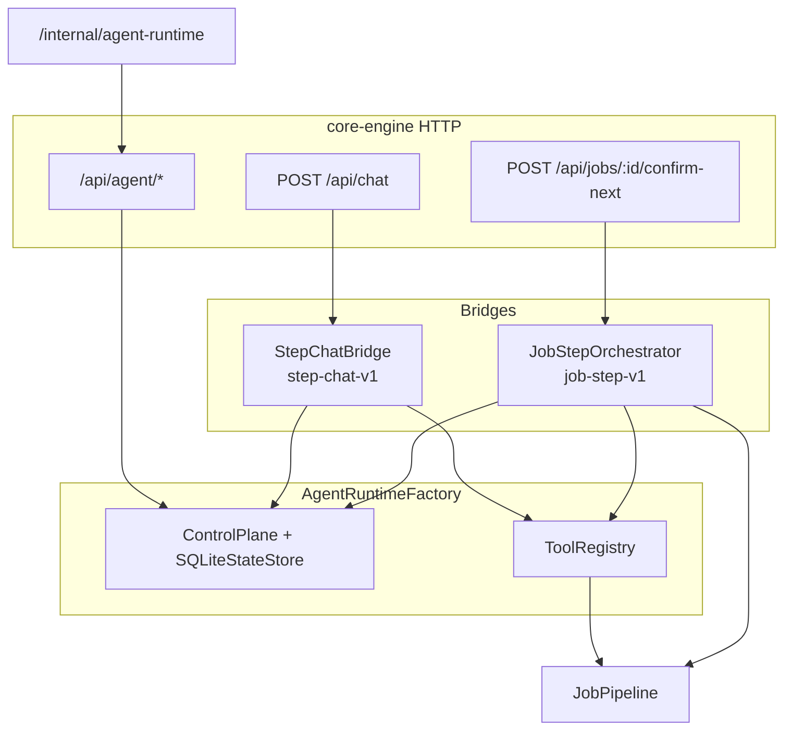

# Design Spec: C3 Agent Orchestration Full（完整认知层接通）

## Goal

在一期 **Agent Connect**（`step-chat-v1` 短图 + `POST /api/chat`）已落地的前提下，接通 `.apt/goal.md` **C3 两层运行时**剩余三项未接通能力：

1. **Job 各 step 自动 `startRun` / `resumeHitl`** — 人点「确认下一步」驱动 agent 图恢复，而非仅改 `Job.status`。
2. **进入 `checking` 且有 blocking finding 时自动 `check_wording`** — 不依赖用户关键词。
3. **`agent-runtime-control` 内部控制面** — 运维/调试可查 run、trace、手动 `resumeHitl`。

**继承一期约束**：认知写库仅 `check_wording` → `t_proposal`；禁 `submit_*`；Agent 不直连业务库/MinIO/OCR；Receipt 仅人点 `confirmProposal`。

## 范围（In Scope）

| # | 能力 | 说明 |
|---|------|------|
| 1 | `AgentRuntimeFactory` | 单例 `ControlPlane` + 共享 `ToolRegistry` + 持久化 `SQLiteStateStore`（与 ledger 同库或同目录），供 `StepChatBridge` 与 `JobStepOrchestrator` 复用 |
| 2 | `JobStepOrchestrator` | 新 public contract；`job-step-v1` 长生命周期图；`threadId = job:{job_id}` |
| 3 | 步进钩子 | `openUploadJob` / `runFixtureJob` 进入认知相关 status 后触发 `onStepEntered`；`confirm-next` → `resumeHitl` → `fn` 节点调 `confirmNext` |
| 4 | 自动 `check_wording` | 图内 `checking` 节点：存在 open blocking finding 时自动起草 Proposal（LLM 或模板措辞） |
| 5 | HTTP 代理 | `core-engine` 挂载 `createFetchHandler` 于 `/api/agent/*`（compile/start/get/cancel/resume/trace） |
| 6 | 控制面 Vue 页 | 路由 `/internal/agent-runtime`；列表 run、查看 trace、手动 resume（调试） |
| 7 | `t_job.agent_run_id` | 写入当前 job 级 orchestrator run，便于审计与 UI 关联 |
| 8 | 测试 | `job-step-orchestrator.test.ts` + HTTP 集成 + 控制面 smoke；CI 强制 FakeLlm |

## 非目标（Out of Scope）

- 每步独立一张图（本期采用 **单 job 一张 `job-step-v1` 图**，多 HITL 节点串联）。
- `submit_*` Tool、Agent 写 Receipt、对话内 `confirmProposal`。
- 取消 blocking finding、覆盖硬规则结论。
- Temporal / 独立 agent-runtime 进程端口。
- 智谱 Embedding 替换 `StandardLibrary` RAG。
- 改造 `audit_design_changes` MCP（已知 infra 问题，不挡本片）。
- 将 `agent-runtime-control` 纳入产品 9 页导航（仅 internal 直达，不出现在业务侧栏）。

## 约束（冻结）

| 约束 | 说明 |
|------|------|
| 9 页冻结 | 产品页仍为 9 页；`/internal/agent-runtime` 为 **internal ops 面**，`designs/v0/agent-runtime-control` 已存在，不计入产品第 10 页 |
| 认知写库 | 仅 `check_wording` → `t_proposal` pending |
| HITL 边界 | `appendChat` 不得改 `Job.status`；`confirm-next` 经 orchestrator `resumeHitl` 后由 **受控 fn 节点** 调 `JobPipeline.confirmNext` |
| Tool 白名单 | `check_wording`、`get_job_context`；可选 `search_clause`（只读 StandardLibrary）；禁 `submit_*` |
| threadId | StepChat：`{traceId}:{step}`；Job 图：`job:{job_id}`（二者不混用） |
| LLM | 读 `.apt/agent-runtime.llm.json`；无配置 FakeLlm（与一期一致） |
| 幂等 | Tool `idempotency_key` = `{runId}:{toolName}:{step}`；重复 resume 安全 |

## 验收标准

| ID | 标准 | 可判定方式 |
|----|------|------------|
| A15-reg | `POST /api/chat` 仍返回 `assistant_reply` + `agent_run_id` | 现有 `agent-connect.test.ts` |
| A16-reg | 对话不能 confirm/submit/改 Job.status | 现有测试 |
| AC-orchestrator-start | `runFixtureJob` 到达 `checking` 后存在 `t_agent_run`，`t_job.agent_run_id` 非空，`status` 为 `running` 或 `waiting_hitl` | 新单测 |
| AC-auto-wording | `checking` + open blocking finding → 自动产生 pending `t_proposal`（无需用户说「起草」） | 新单测 |
| AC-confirm-resume | `POST confirm-next` 在 open HITL 时先 `resumeHitl`，再 `Job.status` 沿 `CONFIRM_NEXT` 前进 | HTTP 集成测 |
| AC-no-double-advance | 无 open HITL 时 `confirm-next` 返回 409 或明确错误（禁止静默双跳） | 新单测 |
| AC-control-list | `GET /api/agent/runs` 返回含 job run；`/internal/agent-runtime` 可渲染列表 | smoke + HTTP |
| AC-control-trace | `GET /api/agent/runs/:id/trace` 在 UI 可展示事件序列 | smoke |
| AC-shared-plane | `StepChatBridge` 与 `JobStepOrchestrator` 共用同一 `ControlPlane` 实例（run 可跨图查询） | 单测断言 store 单例 |
| 回归 | `npm test -w core-engine` + `npm test -w agent-runtime` 全绿 | CI |

---

## 追问记录

**收敛方式**：第 2 轮收敛（第 1 轮有实质修订，第 2 轮四镜头无新实质发现）。

### 第 1 轮

| 镜头 | 关键追问 | 结论 / 修订 |
|------|----------|-------------|
| S1 场景 | 谁在什么情况下用完整能力？最高频路径？ | **用户明示**：要「完整能力」。最高频：上传夹具 → `checking` 自动提案 → 人审 → `confirm-next` 进 `pending`；运维偶发查 run/trace |
| S2 破坏 | 什么会让需求失效？只能做一半保哪半？ | 若 `confirm-next` 仍只改 status 则 HITL 形同虚设 → **must** 接 `resumeHitl`。若控制面缺 design 配方，可先 API-only，但用户要完整 → **must** 做 Vue 页（参照 `designs/v0`） |
| S3 可行 | 现有组件能否支撑？ | `query_contract(StepChatBridge)` ✅；`JobStepOrchestrator` 在 ontology 有登记但 **磁盘无文件** → 本期新建。`createFetchHandler` ✅。`query_design(agent-runtime-control)` → **DesignPageNotFoundError** → 实现前用 `designs/v0/agent-runtime-control/page.logic.md` + 实现后 `refresh_asset` |
| S4 验收 | 如何证明做完？ | 上表 AC-* + A15/A16 回归；每条 must 需求对应单测或 HTTP 探针 |

**v1→v2 修订**：
- 明确单 job 一张 `job-step-v1` 图（非每步独立 run）。
- `confirm-next` 必须先 `resumeHitl` 再 `confirmNext`。
- internal 控制面路由 `/internal/agent-runtime`，不破坏 9 页冻结。

### 第 2 轮

| 镜头 | 关键追问 | 结论 |
|------|----------|------|
| S1 | 并发两 tab 同时 confirm-next？ | 第二个请求：无 open HITL → 409；不双跳 status |
| S2 | 自动措辞质量差怎么办？ | Proposal 仍 pending，人可改/拒；自动措辞不替代人审 |
| S3 | SQLite 与内存 ControlPlane 冲突？ | 一期每消息 `createControlPlane()` 内存态；二期 **必须** 持久化，否则 job 图与 chat run 无法关联审计 |
| S4 | StepChat 关键词触发保留？ | **保留并存**：图内自动 + 用户关键词（一期行为） |

第 2 轮无新实质发现 → **收敛**。

---

## 需求锁定表

| ID | 需求描述 | 来源 | 验收标准（可判定） | 优先级 |
|----|----------|------|--------------------|--------|
| R1 | Job 进入认知 step 时自动 `startRun(job-step-v1)` | 用户明示 | AC-orchestrator-start | must |
| R2 | `confirm-next` 经 `resumeHitl` 再推进 status | 追问确认 | AC-confirm-resume | must |
| R3 | `checking` + blocking finding 自动 `check_wording` | 用户明示 | AC-auto-wording | must |
| R4 | `/internal/agent-runtime` 控制面 UI | 用户明示 | AC-control-list/trace | must |
| R5 | `/api/agent/*` REST 代理 | 追问确认 | HTTP 路由单测 | must |
| R6 | `StepChatBridge` 与 orchestrator 共享 ControlPlane | 追问确认 | AC-shared-plane | must |
| R7 | 保留一期 StepChat 关键词触发措辞 | 追问确认 | A6-reg 仍绿 | must |
| R8 | 可选 `search_clause` 只读检索 | AI 假设未确认 | 有则单测，无则 nice 延期 | nice |
| R9 | 9 产品页导航不出现控制面 | 追问确认 | 路由不在业务 layout 侧栏 | must |

---

## Ontology detection

| 查询 | 结果 | 复用决策 |
|------|------|----------|
| `query_ontology()` | C3 切片、agent-runtime 包、StepChatBridge 已登记 | 复用 agent-runtime 内核 |
| `query_contract(StepChatBridge)` | ✅ 可读 | 复用并 refactor 到 Factory |
| `query_contract(JobStepOrchestrator)` | TS file unreadable（幽灵登记） | **新建实现** + `register_contract` 覆盖 |
| `query_design(page=agent-runtime-control)` | DesignPageNotFoundError | 实现参照 `designs/v0/agent-runtime-control/page.logic.md`；落地后 `refresh_asset` |
| `packages/agent-runtime/src/api/http.ts` | `createFetchHandler` 已有 9 路由 | **复用**，prefix `/api/agent` |
| `t_job.agent_run_id` | schema 已有列 | **复用**，orchestrator 写入 |

---

## 方案对比

### 决策 1：Job 级编排模型

| Option | 描述 | Trade-offs |
|--------|------|------------|
| **A（推荐）** | 单 job 一张 `job-step-v1`，多 HITL 节点对应 `uploaded→…→previewed` | 一个 run 贯穿审计链；实现复杂度中等 |
| B | 每 step 独立 `startRun`，`threadId=job:step` | 隔离好但 run 碎片化，confirm 需查多 run |
| C | 不用图，confirm-next 仅回调 pipeline | 违背 C3「按步 HITL」；一期已否决 |

**推荐 A**：与 `t_job.agent_run_id` 单字段语义一致；控制面一条 run 看清全流程。

**红队（最强反方）**：长图崩溃恢复难、单 run 失败拖累整 job。  
**回应**：agent-runtime 已有 checkpoint + EventLog；节点 fn 幂等；失败 run 标 `failed` 不阻塞人工 `confirm-next` 降级路径（记录 audit，二期不实现自动重试）。

### 决策 2：confirm-next 接线

| Option | 描述 | Trade-offs |
|--------|------|------------|
| **A（推荐）** | HTTP → `JobStepOrchestrator.resumeConfirm(jobId)` → `resumeHitl` → fn `confirmNext` | 单一入口；与 HITL 语义一致 |
| B | 双写：先 `confirmNext` 再 best-effort `resumeHitl` | 易出现 status 与 run 不一致 |
| C | 仅 orchestrator 内部调 status，废弃 `confirmNext` API | 破坏现有 HTTP 契约 |

**推荐 A**；红队：无 open HITL 时 confirm 失败体验差 → **缓解**：明确 409 + 文案「当前步无待恢复 Agent 中断」。

### 决策 3：控制面 UI 深度

| Option | 描述 | Trade-offs |
|--------|------|------------|
| **A（推荐）** | 列表 + trace 时间线 + 手动 resume 表单 | 满足调试；工作量可控 |
| B | 全节点可视化画布 | 超 scope；design 标明非目标 |
| C | 仅 Swagger/REST | 用户要完整能力，不满足 R4 |

**推荐 A**。

---

## 架构

### 组件

| 组件 | 职责 |
|------|------|
| `AgentRuntimeFactory` | `getOrCreate()`：加载 llm.json、创建持久化 plane、注册两图、共享 registry |
| `JobStepOrchestrator` | `onStepEntered(job, step)`、`resumeConfirm(jobId, decision?)`、`getRunForJob(jobId)` |
| `job-step-v1` 图 | 节点：`enter_step`(fn) → `maybe_auto_wording`(branch+tool) → `wait_confirm`(hitl) → 循环至 `previewed` 或 end |
| `StepChatBridge` | 重构为使用 Factory；行为与一期一致 |
| `handle-request.ts` | `confirm-next` 委托 orchestrator；挂载 agent routes |
| `apps/web/.../agent-runtime-control` | Run 列表、trace 抽屉、resume 对话框 |

### 数据流（checking 自动措辞）

1. `runFixtureJob` 将 job 置 `checking` → `JobStepOrchestrator.onStepEntered(job, "checking")`。
2. 若尚无 job run：`startRun({ graphId: "job-step-v1", threadId: "job:{id}", input: { jobId, step: "checking" } })`，写 `t_job.agent_run_id`。
3. 图节点 `maybe_auto_wording`：查 open blocking findings → 有则 LLM 生成措辞 → `check_wording` Tool → `proposal_id` 写入 run output/state。
4. 图进入 `wait_confirm` HITL（`waiting_hitl`）。
5. 用户 `POST confirm-next` → `resumeHitl(token, { action: "approve" })` → fn 节点 `pipeline.confirmNext(jobId)` → 图推进到下一 step 或结束。

### 错误处理

| 场景 | 行为 |
|------|------|
| 无 llm.json | FakeLlm；自动措辞用固定模板句（单测可断言） |
| 无 open HITL 时 confirm-next | HTTP 409 + `{ error: "no_open_hitl" }` |
| `resumeHitl` token 过期 | 409 + audit event；不 advance status |
| Tool 失败 | run `failed`；`confirm-next` 仍可降级仅 `confirmNext`（**不默认开启**；spec 要求先修 run 或手动 resume；实现可加 env `AGENT_STRICT_HITL=0` 仅 dev） |
| 重复 `onStepEntered` 同 step | 幂等：已有 waiting_hitl 则 no-op |

### 测试策略

- **单元**：`JobStepOrchestrator` mock plane；FakeLlm；断言 `check_wording` 调用次数。
- **集成**：`http-adapter.test.ts` 扩展 confirm-next + agent routes。
- **前端**：Vitest 可选；至少路由注册 + 列表 mount smoke。
- **禁止**：CI 调用智谱 live API。

---

## 拟改动文件（>8 → high risk）

| 文件 | 变更 |
|------|------|
| `packages/core-engine/src/agent/agent-runtime-factory.ts` | **新建** 共享工厂 |
| `packages/core-engine/src/agent/job-step-orchestrator.ts` | **新建** orchestrator + job-step-v1 |
| `packages/core-engine/src/agent/step-chat-bridge.ts` | 重构用 Factory |
| `packages/core-engine/src/agent/tools.ts` | 可选 `search_clause`；共享 register |
| `packages/core-engine/src/agent/prompts.ts` | 自动措辞 prompt |
| `packages/core-engine/src/pipeline/job-pipeline.ts` | 步进钩子调用 orchestrator |
| `packages/core-engine/src/http/session.ts` | 持有 Factory + Orchestrator |
| `packages/core-engine/src/http/handle-request.ts` | confirm-next、/api/agent/* |
| `packages/core-engine/test/job-step-orchestrator.test.ts` | **新建** |
| `packages/core-engine/test/http-adapter.test.ts` | 扩展 |
| `apps/web/src/router.ts` | `/internal/agent-runtime` |
| `apps/web/src/views/agent_runtime_control/index.vue` | **新建** 控制面 |
| `apps/web/src/services/agent-runtime.ts` | **新建** API client |
| `docs/apt/plans/` | plan-from-spec 产出（非本 spec 正文） |

---

## 依赖寻址

| 依赖 | 路径 |
|------|------|
| 一期 spec | `docs/superpowers/specs/2026-08-29-agent-connect-design.md` |
| ControlPlane / HTTP | `packages/agent-runtime/src/api/control.ts`, `http.ts` |
| CONFIRM_NEXT | `packages/core-engine/src/pipeline/job-pipeline.ts` |
| checkWording | `packages/core-engine/src/pipeline/review.ts` |
| page.logic | `designs/v0/agent-runtime-control/page.logic.md` |
| LLM 配置 | `.apt/agent-runtime.llm.json` |

---

## 风险与残留

| 风险 | 影响 | 缓解 |
|------|------|------|
| **high**：新 public contract `JobStepOrchestrator` | 需人批 spec | `status: draft`，待「批准 spec」 |
| **high**：>8 文件 | 同上 | 分 plan 任务切片 |
| design 未入库 | UI 可能偏离配方 | 以 `designs/v0` 为准；`refresh_asset` 后补 verify |
| ontology 幽灵登记 | 契约查询失败 | 实现后 `register_contract` 修正 |
| `AGENT_STRICT_HITL` 降级 | 生产误开则 HITL 旁路 | 默认 strict=1；仅 dev 文档说明 |
| 自动措辞质量 | 垃圾 Proposal | 人审闸门不变；A16 仍适用 |

---

## 自检清单

- [x] 追问记录 ≥ 2 轮
- [x] 需求锁定表；must 无「AI 假设未确认」
- [x] Ontology detection
- [x] 2–3 方案 + 红队
- [x] architecture / data flow / error / testing
- [x] risk: high（新 public contract + >8 文件）
- [x] 无 placeholder
- [x] 与一期 spec、goal.md C3 约束一致

---

## 审批

**status: draft** — 请审阅后回复「**批准 spec**」以进入 `/plan-from-spec`。未批准前不得实现。
