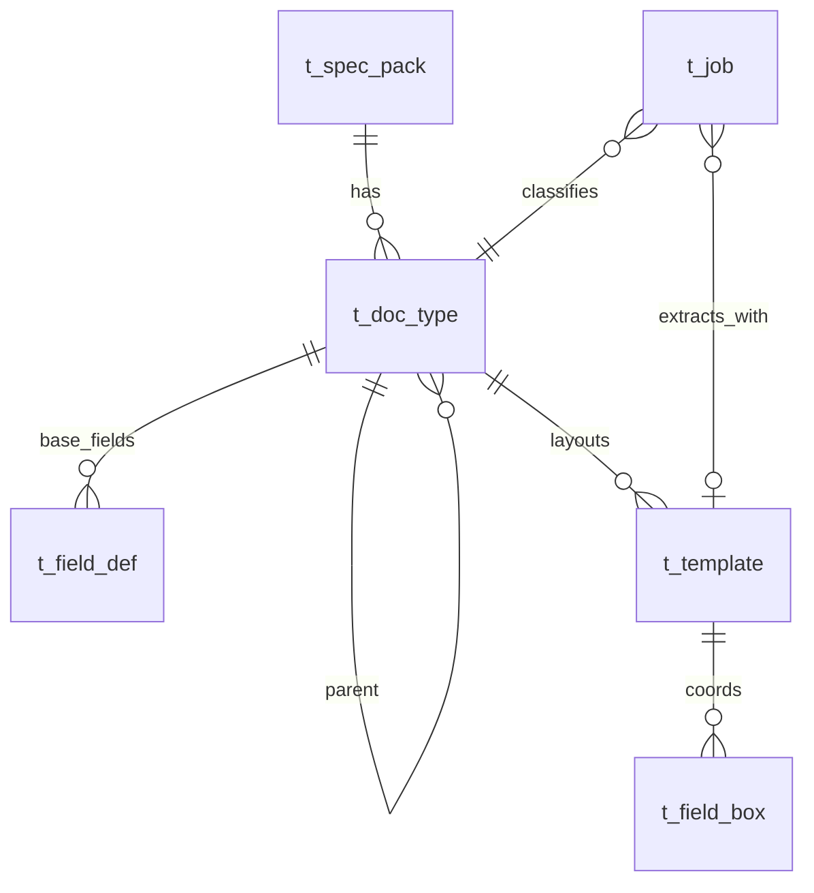

# Design — 文档类型（DocType）与字段继承

**日期：** 2026-08-29  
**来源：** 用户明示（`/apt-auto-brainstorm`）：「类型分档 + 类内公用字段、子类特殊字段」；决策 **1、2 都做**——新增 **DocType 实体** + **第一版字段继承**（类型基字段 + 模板扩展框）。

## Goal

在**不新增冻结页**（仍用 `project_home` / `template_annotate` / `job_upload`）前提下，让「教引擎抽哪些字段」按 **文档类型** 组织：同一类型有**公用字段定义**，具体模板（版式样张）可**扩展特殊字段**并标注坐标；上传任务必须绑定类型/模板，抽取按**合并后的有效字段集**投影。

## 范围

1. **数据模型**：`DocType`（树形可选）、`FieldDef`（类型级语义字段）、`Template.doc_type_id`、`FieldBox`（模板级坐标，可扩展字段）。
2. **合并规则**：抽取时 `effectiveKeys = 继承链 FieldDef ∪ Template FieldBox`；同 key 以 **Template FieldBox** 的 `value_type` 与坐标为准。
3. **API**：DocType / FieldDef CRUD；`GET /api/templates/:id/effective-boxes`；上传必填 `doc_type_id` 或 `template_id`（二选一，解析到 template）。
4. **UI**：
   - `project_home`：规范包下 **文档类型列表** + 各类型模板入口；
   - `template_annotate`：展示 **继承基字段（只读）** + **本模板扩展框（可编辑）** + **页图底图**；
   - `job_upload`：上传前 **选择文档类型**（自动带出默认模板）。
5. **logic 同步**：更新三页 `page.logic.md` 后 `design-sync` / `product-init`。

## 非目标

- 自动文档分类（ML/规则猜类型）；第一版 **用户手选类型**。
- 坐标继承（子模板复用父模板框坐标）；子类只继承 **字段名/类型**，坐标在本模板重标。
- 跨页续表、表格线检测、CAD 抽参。
- 新增第 10 个产品页；不破坏 A1–A10 既有验收语义（A2 扩展为含继承场景）。

## 验收标准

| ID | 标准 |
|----|------|
| AC-1 | 规范包下可创建 ≥2 个 DocType（含父子），列表在 `project_home` 可见 |
| AC-2 | 父类型定义基字段 `编号/日期A`；子类型追加 `特殊批号`；子类型模板保存框后 `effective-boxes` 含 3 key |
| AC-3 | 上传 Job 绑定子类型后，抽取 `fields_json` 含基字段 + 扩展字段；缺 OCR 值为 `null` |
| AC-4 | `template_annotate` 展示 `page_image_uri` 底图（有 URI 时）；无 URI 仍用棋盘格占位 |
| AC-5 | 演示种子迁移：现有夹具 Job 仍 PASS；`http-adapter` + 新单测覆盖 merge / API |
| AC-6 | 三页 `page.logic.md` 与实现一致；`/verify` 无 plan 时新增用例可判 PASS |

---

## 架构

### 实体关系（在现有 E-R 上扩展）



| 实体 | 职责 |
|------|------|
| **DocType** | 文档类型（类）；`pack_id` 归属；`parent_doc_type_id` 可空（子类） |
| **FieldDef** | 类型级字段：`field_key`, `value_type`, `required`（可选）；**无坐标** |
| **Template** | 某类型的版式样张；`doc_type_id` 必填；`page_image_uri` 样张图 |
| **FieldBox** | 模板级框选；可覆盖同名字段的坐标；可含 **仅本模板** 的扩展 key |
| **Job** | 新增 `doc_type_id`；保留 `template_id`（解析默认模板或用户指定） |

### 有效字段合并（抽取 SSOT）

```text
resolveEffectiveBoxes(docTypeId, templateId):
  defs = walkAncestors(docTypeId) flatMap field_defs  // 子覆盖父同 key
  boxes = listFieldBoxes(templateId)
  keys = union(defs.keys, boxes.keys)
  for each key:
    if box exists → use box (coords + value_type from box)
    else if def exists → synthetic box { key, value_type from def, coords: null }
  return list for extractByTemplate
```

抽取仍走 `extractByTemplate(ocrFields, effectiveBoxes)`；无坐标的 def-only key 仍参与 JSON 投影（OCR 硬解析有则填，无则 null）。

### 数据流

1. **配置（教）**：`project_home` 建 DocType → 编辑基字段 → 建 Template → `template_annotate` 标扩展框 + 页图。
2. **使用（用）**：`job_upload` 选 DocType → 默认 Template → 上传 → `Job.doc_type_id` + `Job.template_id` → OCR → merge boxes → `fields_json`。
3. **规则**：DSL 仍引用 `field_key` 字符串；组卷 `groupKeys` 不变。

---

## 组件与页面改动

| 页面 | 改动 |
|------|------|
| `project_home` | 规范包展开：DocType 表（名称、父类型、模板数）+ 操作：编辑基字段、新建模板、标注 |
| `template_annotate` | 顶栏显示 DocType 路径；左侧只读基字段列表；画布仅画扩展/覆盖框；加载 `page_image_uri` |
| `job_upload` | 上传区增加 DocType 下拉（按当前 pack）；选中后展示将使用的 template_id |

**不新增路由页**；DocType 基字段编辑可用 `project_home` 内联卡片或 query 参数 `?pack=:id&docType=:id` 抽屉（实现择一）。

---

## API（草案）

| 方法 | 路径 | 说明 |
|------|------|------|
| GET | `/api/packs/:packId/doc-types` | 列表（含 parent 名） |
| POST | `/api/doc-types` | `{ packId, name, parentDocTypeId? }` |
| PATCH/DELETE | `/api/doc-types/:id` | 改名校删（无模板、无子类型、无 Job 引用） |
| GET/PUT | `/api/doc-types/:id/field-defs` | 基字段 CRUD |
| GET | `/api/templates/:id/effective-boxes` | 合并后框列表（含 inherited 标记） |
| POST | `/api/jobs/upload` | 增加 `doc_type_id`；与 `template_id` 互证归属同一 pack |

现有 `PUT /api/templates/:id/boxes` 仅写 **模板自有框**（扩展+覆盖），不写字段定义表。

---

## 错误处理

| 场景 | 行为 |
|------|------|
| 删除有子类型的 DocType | 409 |
| 删除有 Job 引用的 DocType | 409 |
| 上传未选 doc_type | 400 |
| template 与 doc_type pack 不一致 | 400 |
| 子类型 field_def 与父同 key 不同类型 | 400（须显式覆盖） |

---

## 测试

- `core-engine`：`resolveEffectiveBoxes` 单元测（父+子+模板扩展）。
- `http-adapter`：DocType CRUD + upload 带 doc_type + effective-boxes。
- 回归：`spec-pack-field-boxes` / A2 场景改用 DocType 夹具。

---

## 方案比较（摘要）

| 方案 | 说明 | 结论 |
|------|------|------|
| **A. 仅多 Template** | 每类型一个 Template，无继承 | 简单但重复维护基字段；**否决** |
| **B. DocType + FieldDef + Template 扩展** | 本 spec | **采纳**（用户确认） |
| **C. 独立字段库 + 勾选** | Pack 级 FieldCatalog | 过重；**否决** |

### 红队（推荐 B）

- **最强反方**：父子类型 + 合并规则增加配置错误面（key 冲突、漏标坐标）。
- **回应**：UI 分区（基字段只读 / 扩展可编辑）+ `effective-boxes` 预览 API + 上传前展示将抽取的 key 列表；测试锁住 merge。

---

## 追问记录

**收敛：** 第 2 轮收敛（全自动自问自答，用户已锁定 1+2 都做）。

### 第 1 轮

| 镜头 | 关键追问 | 结论 |
|------|----------|------|
| S1 | 谁配置类型？上传时谁选？ | 配置员在 project_home；操作员 job_upload 手选类型 |
| S2 | 只做多模板不做继承？ | 用户否决；必须继承 |
| S3 | 现有 Template/FieldBox 能否复用？ | 能；加 DocType/FieldDef 表与 merge 函数 |
| S4 | 如何验收继承？ | AC-2/AC-3 可自动化 |

**v1→v2：** 明确不新增页面；Job 增 `doc_type_id`。

### 第 2 轮

| 镜头 | 关键追问 | 结论 |
|------|----------|------|
| S1 | 子类是否多模板？ | 允许；默认模板取该类型第一个 template |
| S2 | 坐标继承要不要？ | 第一版不做（降低风险） |
| S3 | 冻结页门禁？ | goal.md 禁止加页；三页内增强 |
| S4 | A2 是否破坏？ | 扩展 AC，种子数据挂 DocType |

**v2→v3：** 无新实质发现，收敛。

---

## 需求锁定表

| ID | 需求描述 | 来源 | 验收标准 | 优先级 |
|----|----------|------|----------|--------|
| R1 | 引入 DocType（可父子），归属 SpecPack | 用户明示 | AC-1 | must |
| R2 | 类型级 FieldDef（无坐标）+ 模板级 FieldBox（有坐标） | 用户明示 | AC-2 | must |
| R3 | 抽取合并继承链 + 模板扩展 | 用户明示 | AC-3 | must |
| R4 | template_annotate 展示底图与基/扩展字段分区 | 追问确认 | AC-4 | must |
| R5 | job_upload 上传必选 DocType | 追问确认 | AC-3 | must |
| R6 | project_home 管理类型与入口 | 追问确认 | AC-1 | must |
| R7 | 不新增第 10 产品页 | goal.md 冻结 | 代码审查 | must |
| R8 | 自动文档分类 | AI 假设未确认 | — | nice（不做） |

---

## Ontology detection

| 资产 | 复用决策 |
|------|----------|
| `TemplateRow` / `FieldBoxRow` / `extractByTemplate` | **复用**；扩展 merge 入口 |
| `JobPipeline.projectExtractionFields` | **修改**；改为 effective boxes |
| `SpecPackRow` | **复用**；DocType 挂 pack_id |
| `designs/v0/template_annotate` FieldBoxCanvas | **复用**；加分区 UI |
| 新表 `t_doc_type` / `t_field_def` | **新建**；走 schema-apply 增量 |

**MCP 查证：** `query_ontology`、`query_design(page: template_annotate|project_home|job_upload)`、`query_contract(TemplateRow|FieldBoxRow|extractByTemplate)`。

---

## 风险与残留

| 风险 | 缓解 |
|------|------|
| **high**：>8 文件 + 新表 + Job 列扩展 | 分 Task 实现；迁移脚本；feature 分支 |
| 种子/demo 迁移破坏旧 Job | resetDemo 重建 DocType 树 |
| PG/SQLite 双实现漂移 | LedgerStore 同步 + 同一套测试 |

---

## 实现切片建议（供 `/plan-from-spec`）

1. Schema + store + `resolveEffectiveBoxes`
2. HTTP API + tests
3. `project_home` DocType 管理
4. `template_annotate` 分区 + 底图
5. `job_upload` 类型选择
6. logic 同步 + verify
