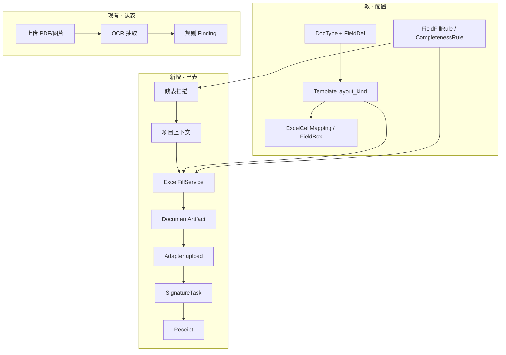
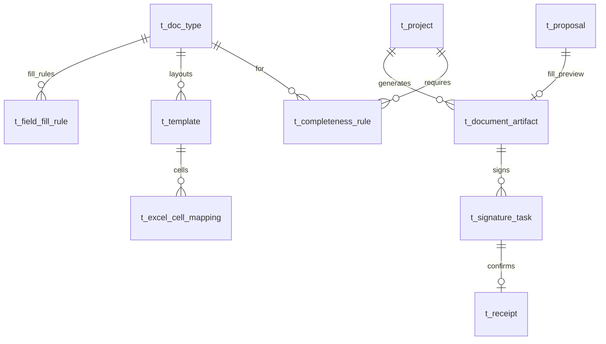

# Design — Excel 缺表补全、生成上传与待签（Gap Fill）

**日期：** 2026-08-29  
**来源：** `/apt-auto-brainstorm` 用户明示场景：

> 房建项目通过接口发现少一份混凝土检验批表 → 组织项目名称、合规指标（如强度等级与允许偏差）、签字人员（监理/施工/送检单位）→ 部分接口拉取、部分按规则生成合规占位值 → **生成 Excel** → 上传中台 → **在现有 9 页内待相关人员签字**。

**已锁定决策：**

| 项 | 决策 |
|----|------|
| 资料形态 | **Excel 文件**（`.xlsx`）；非在线结构化表单（第一版） |
| 模板映射 | **方案 A**：用户上传 Excel，在 `template_annotate` **点选单元格绑字段** |
| 签字入口 | **方案 A**：扩展 `pending_review`（不加第 10 页） |
| 行业内容 | **用户自备模板**；仓库仅提供 **demo 夹具**（非产品预置房建包） |
| 中台对接 | C4 **mock 适配器**本期可验；真实资料云 **非本期**（goal 冻结） |
| Agent | 可提议填数（HITL）；**禁止**代签、禁止无 Receipt 写中台 |

## Goal

在**不新增冻结产品页**前提下，为「可教空引擎」增加 **Excel 出表链路**，与现有「PDF/图片 OCR 认表」并存：

1. **教**：为 DocType 绑定 Excel 模板 + 单元格字段映射 + 合规填数规则；
2. **用**：发现缺表（可配置规则）→ 组织上下文 → 生成合规 `.xlsx` → mock/真实适配器上传 → 创建待签任务；
3. **审**：`pending_review` 内完成签字确认 → `Receipt` 闸门；
4. **证**：全链路 `trace_id` 可审计。

**P0 演示夹具：** `docs/fixtures/excel/concrete-inspection-batch-gb50204-template.xlsx`（GB 50204-2015 同类版式，自行合成，见 `docs/fixtures/excel/README.md`）。

## 范围（In Scope）

### Phase 1 — P0（本期 plan 必须交付）

| # | 能力 | 说明 |
|---|------|------|
| 1 | `layout_kind=excel` | `Template` 支持 Excel 版式（与现有 `raster` 图片框选并存） |
| 2 | Excel 模板存储 | 上传 `.xlsx` 至 Blob（MinIO / MemoryBlobStore）；`excel_template_uri` |
| 3 | 单元格映射 | `ExcelCellMapping`：`sheet` + `cell` + `field_key` + `value_type` + 可选 `signature_role` |
| 4 | `template_annotate` Excel 模式 | 渲染 Sheet 预览（或只读网格）；点格绑 `fieldKey`；继承 FieldDef 只读侧栏复用 |
| 5 | 填数引擎 | `ExcelFillService`：读模板 → 按映射写值（`{{fieldKey}}` 或直写 cell）→ 输出新 blob |
| 6 | 合规规则（子集） | `FieldFillRule`：`required`、`pattern`、`range`、`defaultGenerator`（确定性，非 LLM） |
| 7 | 生成 API | `POST /api/projects/:id/documents/generate`（body: `docTypeId`, `fieldValues?`, `traceId?`） |
| 8 | C4 适配器扩展 | `POST /adapter/documents/upload`（multipart xlsx）→ `receipt_id` + `document_id` |
| 9 | `DocumentArtifact` | 账本记录：生成文件 URI、适配器回执、状态、`trace_id` |
| 10 | `pending_review` 待签 | 同页扩展：`task_kind=wording \| signature`；签字任务关联 `DocumentArtifact` |
| 11 | 签字确认 | 人点签 → `confirmSignatureTask` → `Receipt`（复用 Receipt 闸门语义） |
| 12 | 测试 | 夹具混凝土检验批 end-to-end：映射 → 生成 → mock 上传 → 待签 → Receipt |

### Phase 2 — P1（可紧随 P0，同一 spec 排 Task）

| # | 能力 |
|---|------|
| 13 | `CompletenessRule`：项目 × DocType 应备清单 |
| 14 | `GET /api/projects/:id/document-gaps` 缺表扫描 |
| 15 | `project_home` 展示缺表列表 +「一键补表」入口 |

### Phase 3 — P2（Agent 辅助，HITL）

| # | 能力 |
|---|------|
| 16 | Tool `scan_document_gaps`（只读） |
| 17 | Tool `propose_document_fill` → 写 `t_proposal`（`kind=document_fill`），不直写 Excel |
| 18 | 人审后调 generate API；Agent 禁 `submit_*`、禁代签 |

### Phase 4 — P3（非本期 goal）

- 真实资料云 HTTP 适配器替换 mock  
- 在线结构化表单 `layout_kind=form`（与 Excel 共享上层 Gap Fill 状态机）

## 非目标（Out of Scope）

- 预置公路/水利/房建规范包内容（goal 冻结）；demo 夹具不计入产品包。
- 从商业模板站爬取/复制 xls（版权风险）；用户自备正式省标/地标模板。
- Excel 公式重算引擎、宏、多 Sheet 复杂合并（第一版单 Sheet 主表）。
- Agent 代签、对话内 `confirmProposal` / `confirmSignature`。
- 组卷提交进认知 Tool；Temporal；新增第 10 产品页。
- 真实资料云实挂（goal 明确不做）。

## 验收标准

| ID | 标准 |
|----|------|
| AC-1 | `Template.layout_kind=excel` 可创建；`excel_template_uri` 可下载/预览 |
| AC-2 | `template_annotate` Excel 模式：点选 `B4` 绑定 `project_name` 保存后 `GET /api/templates/:id/excel-mappings` 返回一致 |
| AC-3 | `POST .../documents/generate` 使用混凝土夹具模板 + 演示 `fieldValues` 产出 `.xlsx`；打开后关键格（项目名、强度描述、签字格）已写入 |
| AC-4 | mock `upload` 无 `receipt_id` 时账本**不**记 `committed`；有回执则 `DocumentArtifact.status=uploaded` |
| AC-5 | 上传成功后 `pending_review` 列出 ≥1 条 `signature` 待签（专业监理工程师等角色）；确认后存在 `Receipt` |
| AC-6 | `ToolRuntime.execute("submit_*")` 仍 FORBIDDEN；新 Tool 不得写 Receipt |
| AC-7 | 全链路同一 `trace_id` 在 `audit_trace` 可串起：generate → upload → signature → receipt |
| AC-8 | P1：`document-gaps` 在缺混凝土检验批时返回该 DocType；补表后缺口消失或减 1 |
| AC-9 | 现有 raster 模板 + OCR Job 回归 PASS（`npm test -w core-engine`） |

---

## 架构

### 与现有链路关系



| 链路 | 输入 | 输出 |
|------|------|------|
| **认表（已有）** | 已填好的 PDF/图片 | `fields_json`、Finding |
| **出表（新增）** | 缺表 + 规则/上下文 | `.xlsx` blob、中台 `document_id`、待签任务 |

### 实体关系



| 实体 | 职责 |
|------|------|
| **Template**（扩展） | `layout_kind`: `raster` \| `excel`；`excel_template_uri`；`excel_sheet_name`（默认第一张业务表） |
| **ExcelCellMapping** | 模板级：`sheet`, `cell`（如 `B4`）, `field_key`, `value_type`, `signature_role?` |
| **FieldFillRule** | DocType 级填数规则：`field_key`, `required`, `pattern?`, `min?`, `max?`, `default_generator?`（`literal` \| `project_field` \| `compliance_sample`） |
| **CompletenessRule** | Pack/Project 级：`doc_type_id`, `required`, `label` |
| **DocumentArtifact** | `artifact_id`, `project_id`, `doc_type_id`, `file_uri`, `adapter_document_id?`, `status`, `trace_id` |
| **SignatureTask** | `task_id`, `artifact_id`, `role`, `assignee_label?`, `status`（`pending` \| `signed` \| `rejected`）, `trace_id` |
| **Proposal**（扩展） | 可选列 `proposal_kind`: `wording` \| `document_fill`；`payload_json` 存拟填字段快照 |
| **Receipt** | 复用；签字确认与措辞确认均产出 Receipt |

### 有效字段合并（Excel 模式）

```text
resolveEffectiveExcelMappings(docTypeId, templateId):
  defs = walkAncestors(docTypeId) flatMap field_defs
  cells = listExcelCellMappings(templateId)
  keys = union(defs.keys, cells.field_key)
  for each key:
    cell = cells[key] if exists
    rule = field_fill_rules[key] if exists
    yield { field_key, cell, value_type, rule, signature_role }
```

填数时：**显式传入 `fieldValues` > 规则生成 > 留空**；`value_type=signature` 的格在生成阶段写角色占位名或留空，**签字后二次写回**（P0 可仅留空 + 待签列表展示角色）。

### 数据流（P0 主路径）

1. **配置**：`project_home` 为 DocType「混凝土检验批」建 Template（`layout_kind=excel`）→ 上传夹具 xlsx → `template_annotate` 点格绑字段 → 配置 `FieldFillRule`（如 `strength_grade` pattern `C\d{2}`）。
2. **生成（手动触发 P0）**：`project_home` 选项目 →「生成检验批」→ 后端拉项目元数据 + 规则生成 `fieldValues` → `ExcelFillService` → `DocumentArtifact`（`status=generated`）。
3. **上传**：调 `adapter.uploadDocument(multipart)` → 得 `receipt_id` → `DocumentArtifact.status=uploaded`。
4. **待签**：为 `signature_role` 列表创建 `SignatureTask` → `pending_review` 展示。
5. **签字**：监理/施工等角色点签 → `confirmSignatureTask` → `Receipt` + 可选回写 Excel 签字格（P0 可只记账本签字人姓名）。

---

## 组件与页面改动

| 页面 | 改动 |
|------|------|
| `project_home` | DocType 行增加「Excel 模板」入口；展示 `document-gaps`（P1）；「生成并上传」按钮（P0） |
| `template_annotate` | 顶栏切换 `raster \| excel`；Excel 模式：Sheet 网格/iframe 预览 + 点格高亮 + 映射列表；保存 `excel-mappings` |
| `pending_review` | Tab 或筛选：`措辞待审` / `资料待签`；待签卡片展示 artifact 摘要、角色、下载 xlsx；确认签字 |
| `audit_trace` | 事件类型增：`document_generated`, `document_uploaded`, `signature_confirmed` |

**不新增路由页**；internal 调试可复用现有 `/internal/agent-runtime`（P2 Agent 拟填预览）。

---

## API（草案）

### 模板与映射

| 方法 | 路径 | 说明 |
|------|------|------|
| POST | `/api/templates` | 增 `layout_kind`, `excel_sheet_name?` |
| POST | `/api/templates/:id/excel-template` | multipart 上传 `.xlsx` → `excel_template_uri` |
| GET | `/api/templates/:id/excel-mappings` | 列表 |
| PUT | `/api/templates/:id/excel-mappings` | `{ mappings: ExcelCellMapping[] }` |
| GET | `/api/doc-types/:id/fill-rules` | FieldFillRule CRUD |
| PUT | `/api/doc-types/:id/fill-rules` | 同上 |

### 出表与缺口

| 方法 | 路径 | 说明 |
|------|------|------|
| POST | `/api/projects/:projectId/documents/generate` | `{ docTypeId, templateId?, fieldValues?, traceId? }` → `{ artifact, downloadUrl }` |
| POST | `/api/projects/:projectId/documents/:artifactId/upload` | 调适配器上传；返回 `receipt` |
| GET | `/api/projects/:projectId/document-gaps` | P1：`{ missing: [{ docTypeId, label }] }` |
| GET | `/api/projects/:projectId/completeness-rules` | P1 CRUD |

### 待签

| 方法 | 路径 | 说明 |
|------|------|------|
| GET | `/api/pending/signatures` | `SignatureTask[]` status=pending |
| POST | `/api/signature-tasks/:id/confirm` | `{ signerName }` → Receipt |
| GET | `/api/proposals` | 增筛 `kind=wording\|document_fill`（兼容现有 list） |

### C4 适配器（扩展 `docs/schema/generated/adapter-openapi.yaml`）

```yaml
POST /adapter/documents/upload:
  multipart: project_id, doc_type_id, file, metadata(JSON), trace_id
  response: { receipt_id, document_id, status }

POST /adapter/documents/gap-scan:
  query: project_id
  response: { missing: [{ doc_type_id, reason }] }  # P1；P0 mock 可返回固定缺口
```

Mock 实现延续 `packages/core-engine/src/adapter/mock.ts`：`commitAdapterWrite` 无 `receipt_id` 抛错。

---

## 填数规则（FieldFillRule）语义

| `default_generator` | 行为 |
|---------------------|------|
| `literal` | 固定默认值（如验收依据 GB50204-2015 全文） |
| `project_field` | 从 `Project` / 项目扩展元数据取（`project_name`, `constructor_org`…） |
| `compliance_sample` | 确定性采样：在 `min`/`max`/`pattern` 内生成（如 C30、试块 3 组描述模板） |
| （空） | 生成时留空或保留模板内 `{{fieldKey}}` |

**禁止**：LLM 在无规则框外「编造」强度报告编号等需溯源字段（P2 Agent 仅建议，人审后写入）。

---

## Agent（P2）

| Tool | 读写 | 说明 |
|------|------|------|
| `scan_document_gaps` | 只读 | 调 `document-gaps` API |
| `propose_document_fill` | 写 Proposal | `kind=document_fill`, `payload_json=fieldValues` |
| `get_job_context` | 只读 | 已有；可扩 project 元数据 |

**禁止**：`apply_document_upload`, `confirm_signature`, 一切 `submit_*`。

---

## 依赖

| 包 | 用途 |
|----|------|
| `exceljs`（或等价） | 读模板、写 cell、输出 buffer |
| 现有 `BlobStore` | 存模板与生成件 |
| 现有 `Receipt` / `AuditEvent` | 闸门与 trace |

---

## 错误处理

| 场景 | HTTP | 行为 |
|------|------|------|
| raster 模板调 excel-mappings API | 400 | `layout_kind` 不匹配 |
| 映射 cell 重复绑定 | 409 | 保存拒绝 |
| 必填 field 无规则且无传入值 | 422 | generate 失败，audit `fill_validation_error` |
| 适配器无 receipt | 502/424 | 不更新 artifact 为 uploaded |
| 重复 confirm 同一 signature task | 409 | 幂等或拒绝 |
| 删除有 artifact 的 template | 409 | |

---

## 测试

| 层级 | 内容 |
|------|------|
| 单元 | `ExcelFillService`：夹具 xlsx + mapping JSON → buffer 指定 cell 值 |
| 单元 | `resolveEffectiveExcelMappings` 继承 FieldDef |
| 集成 | `http-adapter`：generate → upload mock → list signatures → confirm → receipt |
| 回归 | raster OCR Job、check_wording Proposal、A6/A8 |
| E2E 夹具 | `docs/fixtures/excel/concrete-inspection-batch-cell-mapping.json` 为 SSOT |

---

## 方案比较

| 方案 | 说明 | 结论 |
|------|------|------|
| **A. JSON/YAML 手填映射** | 不上传 UI，只编辑 mapping 文件 | 实现快但不符合用户选的点格绑字段；**否决** |
| **B. Excel 点格 + ExcelFill + mock 上传 + pending 待签** | 本 spec | **采纳** |
| **C. 在线表单替代 Excel** | 不做 xlsx | 与用户选中 A 冲突；**Phase 4** |
| **D. Agent 全自动补表代签** | 无 HITL | 合规/责任边界不允许；**否决** |

### 红队（推荐 B）

- **反方**：Excel 渲染在浏览器难、合并单元格坐标易错、与 raster FieldBox 两套 UX。
- **回应**：第一版 Excel 预览可用 **只读表格截图** 或 **轻量 grid**（显示 cell 地址即可点选）；合并格以 **左上角 cell** 为映射锚点；`layout_kind` 显式分支，不混用 FieldBox 表。

---

## 追问记录（brainstorm 收敛）

### 第 1–3 轮（摘要）

| 镜头 | 结论 |
|------|------|
| S1 场景 | 中台查缺表 → 组织合规数据 → 生成表 → 签字；混合本仓 ledger + 外部中台 |
| S2 破坏 | 无 Receipt 闸门、Agent 代签、预置行业包与 goal 冲突 |
| S3 可行 | 现有仅 OCR 认表；需新 Excel 出表链 + 适配器 + 待签扩展 |
| S4 验收 | 混凝土夹具 end-to-end + trace + 回归 raster |

**用户锁定：** 签字在 9 页内（A）；资料形态 Excel（A）；映射点格（A）。

---

## 需求锁定表

| ID | 需求描述 | 来源 | 验收 | 优先级 |
|----|----------|------|------|--------|
| R1 | Template 支持 `layout_kind=excel` 与模板文件上传 | 用户明示 | AC-1 | must |
| R2 | 单元格点选绑定 fieldKey | 用户选 A | AC-2 | must |
| R3 | 按映射与规则生成 xlsx | 用户明示 | AC-3 | must |
| R4 | mock 适配器上传 + Receipt 闸门 | goal C4 | AC-4 | must |
| R5 | pending_review 资料待签 + 确认 Receipt | 用户选 A | AC-5 | must |
| R6 | Agent 不代签、不 submit | goal C3 | AC-6 | must |
| R7 | trace_id 贯通 | goal C5 | AC-7 | must |
| R8 | 缺表扫描与一键补表 | 用户场景 | AC-8 | should（P1） |
| R9 | raster/OCR 回归不退化 | 工程约束 | AC-9 | must |
| R10 | 真实资料云 HTTP | — | — | **won't（本期）** |
| R11 | 预置房建规范包 | — | — | **won't** |

---

## Ontology / 资产复用

| 资产 | 决策 |
|------|------|
| `DocType` / `FieldDef` | **复用**；Excel 映射引用同一 `field_key` |
| `Template` / `FieldBox` | **扩展**；raster 路径不变 |
| `Proposal` / `Receipt` | **扩展** kind；Receipt 语义不变 |
| `adapter/mock.ts` | **扩展** upload |
| `template_annotate` FieldBoxCanvas | **复用模式**；Excel 新组件 `ExcelCellPicker` |
| `docs/fixtures/excel/*` | **演示 SSOT**；非产品包 |
| `exceljs` | **新建依赖** |

**MCP 落地前：** `query_contract(TemplateRow|ProposalRow|ReceiptRow)`、`query_design(page: template_annotate|pending_review|project_home)`、`audit_arch_changes`。

---

## 风险与残留

| 风险 | 级别 | 缓解 |
|------|------|------|
| 新表 ≥4 + exceljs + 三页改动 | high | 分 Phase Task；P0 不绑 Agent |
| Excel 预览实现成本 | medium | P0 可用 cell 坐标列表 + 简表，不追求像素级还原 |
| 与 goal「资料云不实挂」 | low | mock 验收；真实对接单独立项 |
| 签字回写 xlsx | medium | P0 账本签字即可；回写 cell 为 P1 nice |
| PG/SQLite 双 store | medium | 与 DocType 片相同步策略 |

---

## 实现切片建议（供 `/plan-from-spec`）

| Task | 内容 | Phase |
|------|------|-------|
| 1 | Schema：`layout_kind`, `t_excel_cell_mapping`, `t_field_fill_rule`, `t_document_artifact`, `t_signature_task` | P0 |
| 2 | `exceljs` + `ExcelFillService` + 夹具单测 | P0 |
| 3 | HTTP：excel-template upload、mappings CRUD、generate、upload | P0 |
| 4 | adapter-openapi + mock upload | P0 |
| 5 | `template_annotate` Excel 点格 UI | P0 |
| 6 | `pending_review` 待签 Tab + confirm API | P0 |
| 7 | `project_home` 生成入口 + audit 事件 | P0 |
| 8 | `t_completeness_rule` + document-gaps | P1 |
| 9 | Agent Tools + Proposal kind | P2 |
| 10 | 三页 `page.logic.md` 同步 + `/verify` | P0/P1 |

---

## 附录：演示夹具字段（节选）

见 `docs/fixtures/excel/concrete-inspection-batch-cell-mapping.json`。

| fieldKey | cell | 说明 |
|----------|------|------|
| `project_name` | B4 | 单位工程名称 |
| `strength_sampling_record` | E13 | 强度等级与取样描述 |
| `supervisor_engineer_sign` | C27 | 专业监理工程师（待签） |

重新生成：

```bash
python scripts/generate-concrete-inspection-batch-xlsx.py
```
